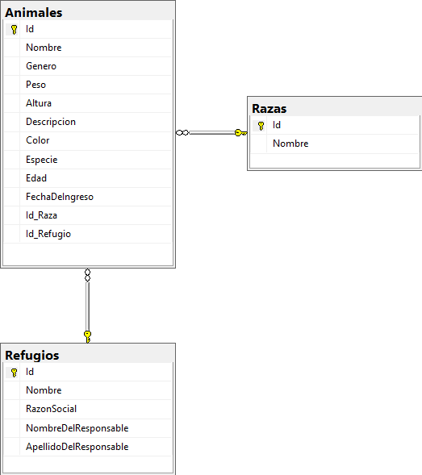

# Programación avanzada II - UNLaM 2023

## Trabajo Práctico Principal Grupo 4

| Integrantes  |
| ------------- |
| Gustavo Vasquez Zurita |
| Nicolás Lopiano |
| Marcos Quispe Velásquez |
| Verónica Parra Sandi |

#### Tecnologías utilizadas:
- ASP.NET 6 Web API
- SQL Server Express 2022
- Entity Framework Core 7
- Entity Framework Core InMemory
- xUnit

## Introducción

En este trabajo práctico, se presenta la implementación de un CRUD (Create, Read, Update, Delete) en C# utilizando ASP.NET Core WEB API. El sistema se centra en la gestión de animales de refugios, permitiendo a los usuarios realizar operaciones como la creación, lectura, actualización y eliminación de registros de animales (adicionalmente se pueden consultar las razas y refugios).

## Arquitectura de la aplicación

Para la generación de la base de datos SQL Server se ha utilizado el enfoque **Code First** de Entity Framework, dónde primero se crean las clases correspondientes a cada entidad para que luego se puedan mapear como entidades de base de datos.

> **NOTA:** primero se debe ejecutar el comando ```update-database``` mediante el Package Manager Console de Visual Studio para crear la base de datos.

*DER*



A continuación se listan todas las operaciones que se pueden realizar:

1. **Crear animal ->** POST https://localhost:7167/api/animales
2. **Editar animal ->** PUT https://localhost:7167/api/animales/{id}
3. **Borrar animal ->** DELETE https://localhost:7167/api/animales/{id}
4. **Listar animales ->** GET https://localhost:7167/api/animales
5. **Visualizar animal ->** GET https://localhost:7167/api/animales/{id}
6. **Buscar animales por color y/o especie ->** GET https://localhost:7167/api/animales/buscar?color={color}&especie={especie}
7. **Listar razas ->** GET https://localhost:7167/api/animales/razas (registros precargados)
8. **Listar refugios ->** GET https://localhost:7167/api/refugios (registros precargados)

#### Controladores

Los controladores en ASP.NET Core Web API gestionan las solicitudes HTTP en relación al tipo de operación que se quiere realizar. En este proyecto, se han implementado dos controladores principales: ```AnimalController``` y ```RefugioController```.

*AnimalController*

- El controlador AnimalController se encarga de las operaciones relacionadas con los animales, como la creación, lectura, actualización y eliminación de registros de animales.
- Los métodos del controlador manejan las solicitudes HTTP e interactúan con los métodos de su repositorio correspondiente para realizar las operaciones solicitadas.
- Se utiliza una variedad de atributos como ```[HttpGet], [HttpPost], [HttpPut] y [HttpDelete]``` para definir las rutas y los tipos de solicitud HTTP correspondientes a cada método.
- Se incluye una solicitud GET para obtener todos los registros de razas disponibles.

*RefugioController (Adicional)*

- Contiene solamente la operación para obtener todos los registros de refugios disponibles.

#### Repositorios

Se han definido tres interfaces de repositorio:

- ```IRepository```: contiene los métodos CRUD.
- ```IAnimalRepository```: hereda los métodos de ```IRepository``` y contiene los métodos específicos para obtener los datos de animales según la lógica de negocio.
- ```IRefugioRepository```: hereda los métodos de ```IRepository```.

Luego se han definido sus implementaciones concretas ```AnimalRepository``` y ```RefugioRepository``` que se encargan de interactuar con la base de datos a través de Entity Framework Core.

## Operaciones Principales

A continuación, se describen las operaciones principales que se pueden realizar en la aplicación:

**Crear un Animal**

La operación de creación de un animal se realiza a través del método ```CreateAnimal``` de ```AnimalController```. Se valida que los datos ingresados cumplan con las restricciones definidas en la clase ```AnimalDTO```. Luego, se convierte el DTO en una entidad ```Animal``` y se almacena en la base de datos a través del método ```Create``` de ```AnimalRepository```.

**Actualizar un Animal**

La actualización de un animal se lleva a cabo mediante el método ```UpdateAnimal``` de ```AnimalController```. Se busca el animal a través de su identificador y se verifica su existencia. Luego, se actualizan los datos y se almacena la entidad actualizada en la base de datos a través del método ```Update``` de ```AnimalRepository```.

**Eliminar un Animal**

La operación de eliminación de un animal se realiza a través del método ```DeleteAnimal``` de ```AnimalController```. Se busca el animal por su identificador y, si existe, se elimina de la base de datos a través del método ```Delete``` de ```AnimalRepository```.

**Consultar Animales**

La consulta de animales se puede realizar de varias formas:

- Obteniendo un animal específico por su identificador a través del método ```GetAnimal```.
- Obteniendo la lista de todos los animales disponibles mediante el método ```GetAnimales```.
- Realizando una búsqueda por color y/o especie con el método ```Search```.


**Adiciones**

Adicionalmente se pueden consultar: 

1. Los refugios disponibles a través del método ```GetAllRefugios``` ubicado dentro de ```RefugioController```, que obtiene la lista de todos los refugios.
2. Todas las razas existentes a través del método ```GetRazas``` dentro de ```AnimalController```, que devuelve un listado con todas las razas.

## Validaciones

Se han implementado validaciones en la clase ```AnimalDTO``` utilizando atributos de validación de ASP.NET Core (Data Annotations), como ```Required, MaxLength, RegularExpression, y Range```. Estas validaciones garantizan que los datos ingresados cumplan con las restricciones definidas.

## Pruebas unitarias

Se han implementado tests unitarios utilizando la librería *xUnit* para verificar que se pueden realizar cada una de las operaciones CRUD de animales correctamente y que devuelve el código de respuesta esperado en cada caso. También se ha utilizado la librería *Entity Framework Core In Memory* para realizar las pruebas en una base de datos en memoria.

## Historias de usuario

Historias de usuario y sus criterios de aceptación basados en las operaciones que se pueden realizar en la API REST:


**1. Crear un Animal**

Título: Crear un nuevo animal en el sistema 

Descripción: Como administrador del refugio de animales, quiero poder agregar un nuevo animal al sistema para que esté disponible para adopción. 

*Criterios de Aceptación:*

- Puedo hacer una solicitud para agregar un nuevo animal.
- Debo proporcionar la información requerida, como nombre, raza, género, peso, altura, color, edad y fecha de ingreso del animal.
- Si la solicitud es exitosa, el animal se agrega a la base de datos y está disponible para su adopción. 


**2. Editar un Animal**

Título: Editar la información de un animal existente

Descripción: Como administrador del refugio de animales, quiero poder actualizar la información de un animal en el sistema si se producen cambios en sus datos.

*Criterios de Aceptación:*

- Puedo hacer una solicitud para editar la información de un animal existente.
- Debo proporcionar la información actualizada, como nombre, raza, género, peso, altura, color, edad y fecha de ingreso del animal.
- Si la solicitud es exitosa, la información del animal se actualiza en la base de datos.


**3. Borrar un Animal**

Título: Eliminar un animal del sistema

Descripción: Como administrador del refugio de animales, quiero poder eliminar un animal del sistema si ya no está disponible para adopción.

*Criterios de Aceptación:*

- Puedo hacer una solicitud para eliminar un animal del sistema.
- Si la solicitud es exitosa, el animal se elimina de la base de datos y ya no está disponible para adopción.


**4. Listar Animales**

Título: Ver una lista de todos los animales disponibles

Descripción: Como usuario interesado en adopción, quiero poder ver una lista de todos los animales disponibles en el sistema para poder encontrar un animal que me interese.

*Criterios de Aceptación:*

- Puedo hacer una solicitud para obtener una lista de todos los animales disponibles.
- Recibo una lista de animales con detalles como nombre, raza, género, peso, altura, color, edad y fecha de ingreso del animal.


**5. Visualizar un Animal**

Título: Ver los detalles de un animal específico

Descripción: Como administrador del refugio de animales o usuario interesado en adopción, quiero poder ver los detalles de un animal específico en el sistema.

*Criterios de Aceptación:*

- Puedo hacer una solicitud para ver los detalles de un animal específico.
- Recibo información detallada, como nombre, raza, género, peso, altura, color, edad y fecha de ingreso del animal.


**6. Buscar Animales por Color y/o Especie**

Título: Buscar animales por color y/o especie 

Descripción: Como usuario interesado en adoptar un animal, quiero poder buscar animales por color y/o especie en el sistema para poder encontrar más fácilmente un animal que me interese.

*Criterios de Aceptación:*

- Puedo hacer una solicitud para buscar animales por color y/o especie.
- Puedo proporcionar parámetros opcionales de color y especie para filtrar la lista de animales.
- Recibo una lista de animales que coinciden con los criterios de búsqueda.


**7. Listar Razas**

Título: Ver una lista de razas de animales

Descripción: Como administrador del refugio de animales o usuario interesado en adopción, quiero poder ver una lista de razas de animales predefinidas en el sistema para saber que razas puedo llegar a encontrar en el sistema.

*Criterios de Aceptación:*

- Puedo hacer una solicitud para obtener una lista de razas de animales predefinidas.
- Recibo una lista de razas con detalles como nombre y características.


**8. Listar Refugios**

Título: Ver una lista de refugios

Descripción: Como usuario interesado en adopción, quiero poder ver una lista de refugios de animales predefinidos en el sistema para saber dónde se encuentran los animales que voy a visualizar.

*Criterios de Aceptación:*

- Puedo hacer una solicitud para obtener una lista de refugios de animales predefinidos.
- Recibo una lista de refugios con detalles como nombre, ubicación y descripción.

## Conclusiones

En este trabajo práctico, se ha implementado con éxito un CRUD en C# utilizando ASP.NET Core para la gestión de animales. La aplicación sigue una estructura organizada, utiliza Entity Framework Core para interactuar con la base de datos y se han aplicado validaciones para garantizar la integridad de los datos ingresados por el usuario.

## Referencias

- [Documentación de ASP.NET Core](https://docs.microsoft.com/en-us/aspnet/core)
- [Entity Framework Core](https://docs.microsoft.com/en-us/ef/core/)
